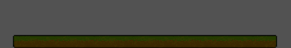

## Lee Chanhui___@chan2ie
### Passionate, creative, and challenging✨

> 💻 Junior Developer  
> 🏫 Majored Computer Science / Art & Technonlogy in Sogang Univ. 
> 💖 Love to learn and create new things!

#### Experiences
- 2021.11 ~  Game Programmer [@MapleStoryKR](https://maplestory.nexon.com/)
- 2020.03 ~ 2021.03 Video editor / Channel manager [@mr.MP/Youtube](https://www.youtube.com/channel/UCQ_db0bwBvWJian998nzq4w)
- 2020.09 ~ 2021.02 Intern (Software Developer) [@Oncosoft](http://oncosoft.io/)
- 2019.09 ~ 2020.11 Visual director / Stage director/ Planning and promotion [@theglobularcluster](https://www.instagram.com/theglobularcluster/)
- 2018.03 ~ 2020.02 Stage team / Promotion design [@Sogang Theatre](https://www.instagram.com/sgtheatre_109/)
- 2017.09 ~ 2020.02 President(2018) / Planning and promotion / Contents creator [@SGAEM]([https://www.facebook.com/search/top?q=sgaem](https://www.sgaem.kr/))

#### Tech Stacks

  </a>&nbsp
  </a>&nbsp
  </a>&nbsp

#### Contacts

  </a>&nbsp
  </a>&nbsp
  </a>&nbsp

#### You may also find me at...

  &nbsp

<!--
**chan2ie/chan2ie** is a ✨ _special_ ✨ repository because its `README.md` (this file) appears on your GitHub profile.

Here are some ideas to get you started:

- 🔭 I’m currently working on ...
- 🌱 I’m currently learning ...
- 👯 I’m looking to collaborate on ...
- 🤔 I’m looking for help with ...
- 💬 Ask me about ...
- 📫 How to reach me: ...
- 😄 Pronouns: ...
- ⚡ Fun fact: ...
-->
